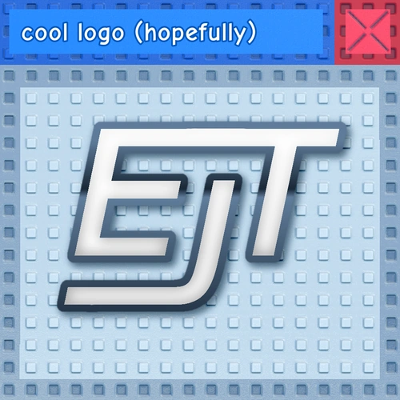

<div align="center">
    
</div>

# EToH Joke Towers

An API for managing and interacting with the [EToH Joke Towers](https://jtohs-joke-towers.fandom.com/wiki/Eternal_Joke_Towers_(EJT)_Wiki) Difficulty Chart. This package provides a structured way to define, organize, and retrieve difficulty levels, complete with metadata such as names, images, colors, and ratings.

## Installation

Install the package via npm:

```bash
npm install @rbxts/ejt
```

## Usage

### Importing the Library
```ts
import Difficulty from "@rbxts/ejt";
```

### Accessing Predefined Difficulties

You can access predefined difficulties directly as static properties of the Difficulty class:
```ts
const firstDifficulty = Difficulty.TheFirstDifficulty;
console.log(firstDifficulty.name); // "The First Difficulty"
console.log(firstDifficulty.layoutRating); // -10000010
```

### Retrieving Difficulties by ID

Use the `get` method to retrieve a difficulty by its unique ID:
```ts
const difficulty = Difficulty.get("TheLowerGap");
if (difficulty) {
    console.log(difficulty.name); // "The Lower Gap"
}
```

### Creating Custom Difficulties

You can create custom difficulties by chaining the provided methods:
```ts
const customDifficulty = new Difficulty()
    .setName("Custom Difficulty")
    .setImage(1234567890)
    .setColor(Color3.fromRGB(255, 0, 0))
    .setRating(42)
    .setClass(1);
const id = "CustomDifficulty";
Difficulty.set(id, customDifficulty);
```

## Development

### Prerequisites
- Node.js
- npm
- Roblox TypeScript (roblox-ts)

### Setup

1. Clone the repository:
```bash
git clone https://github.com/evilbocchi/ejt.git
cd ejt
```

2. Install dependencies
```bash
npm install
```

3. Build the project:
```bash
npm run build
```

## Contributing

Contributions are welcome! Please follow these steps:
1. Fork the repository.
2. Create a new branch for your feature or bugfix.
3. Commit your changes and push the branch.
4. Open a pull request.

## License

This project is licensed under the MIT License. See the LICENSE file for details.